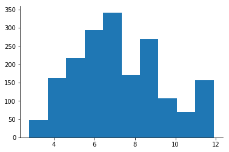
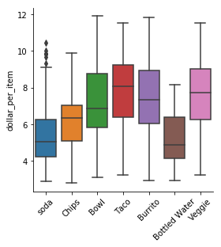
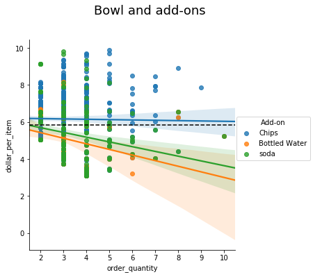
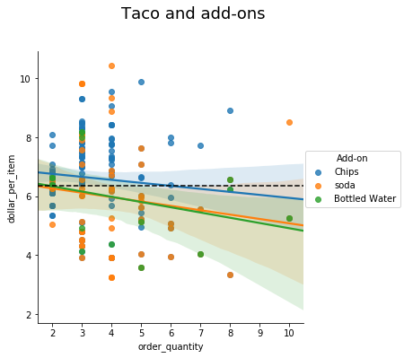
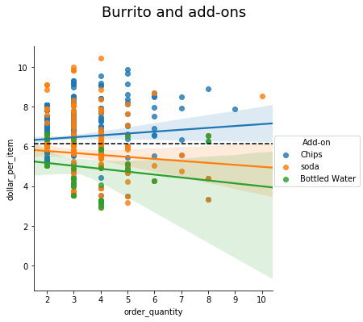

# Chipotle dollar per item 
Playing around with Scott Cole's version of a Chipotle analysis (https://github.com/srcole/burritos/blob/master/Chipotle%20orders.ipynb)  

h/t [@jGage718](https://twitter.com/jGage718/)

## Most folks are spending $6-8 at Chipotle 
### Dollar per item histogram

## Bowls, tacos, and burritos tend to be the big-ticket items 
### Dollar per item, split by item  

## Chips tend to increase the dollar per item, no matter what big-ticket item 

